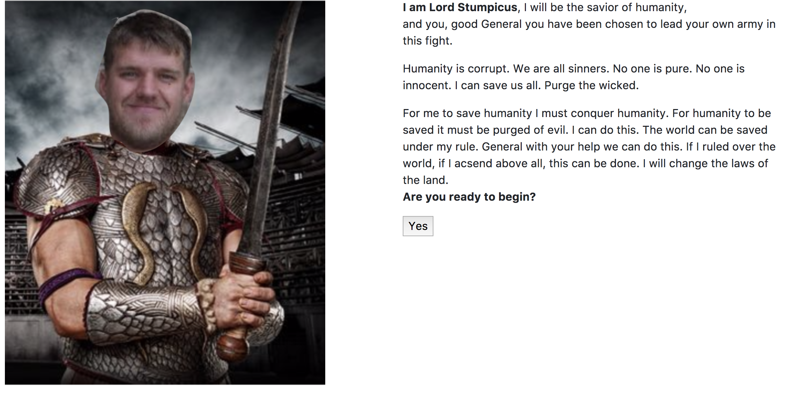
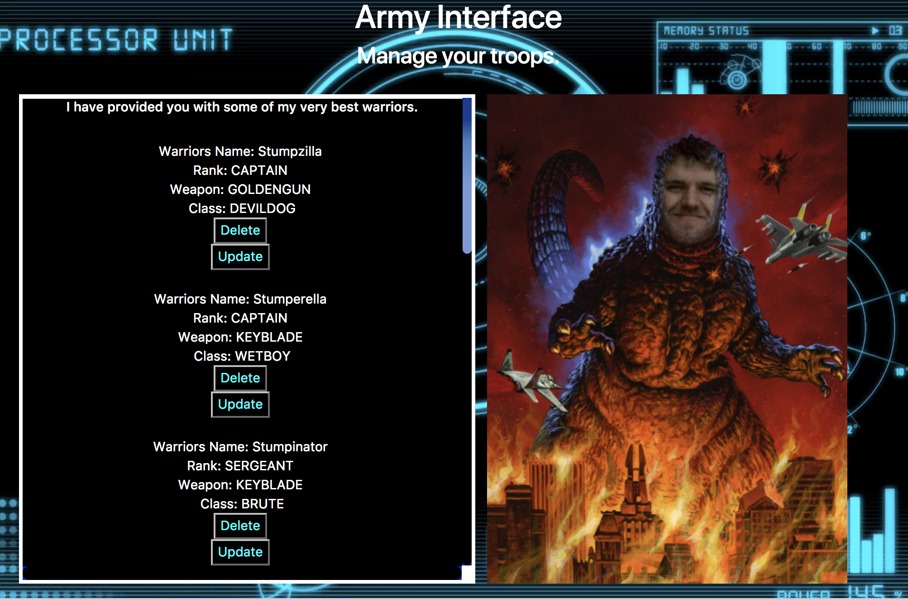
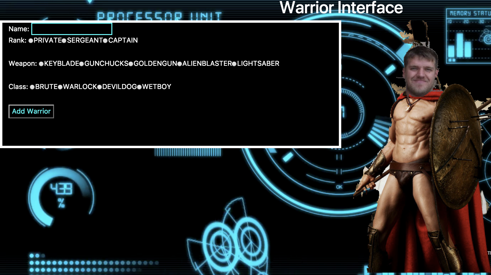

## MVC Crud Project(11/2017)
### David Stumpe AKA Lord Stumpicus
Description of my CRUD project and technologies I used for this project...
My project is designed to demonstrate what I've learned up to this point at Skill Distillery. In this project I demonstrate CRUD, Create, Retrieve, Update, Delete. More explanation to come.
* Gradle
* Spring
* CSS
* HTML
* JSP
* Bootstrap
* 

Screenshot of my working website...
 
 
 
 

Instructions for using my website...
It's easy. Begin by entering your name and clicking submit. 
Following the text click the yes button.
Scroll through to see the current items in the army.
Select update to be taken to an update screen where you are able to change that unit's name, weapon, class, and rank.
Select delete to automatically delete that unit.
Scroll to the bottom of the units to add a new one.

Link to my website running on Amazon
 
